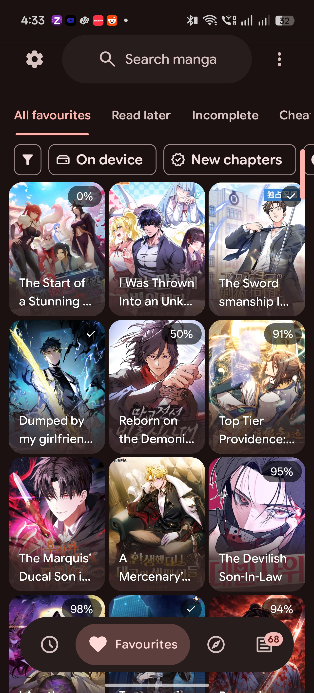
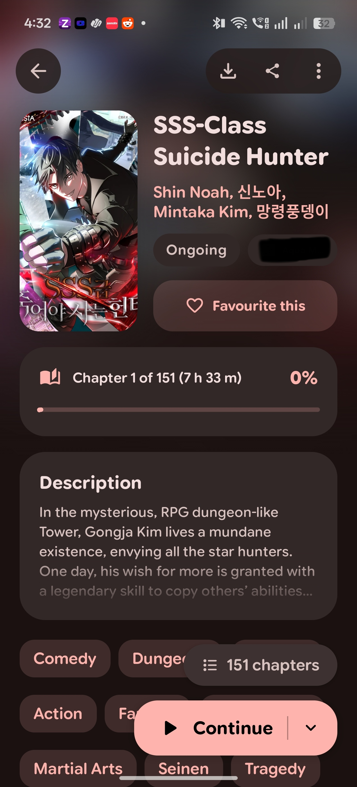
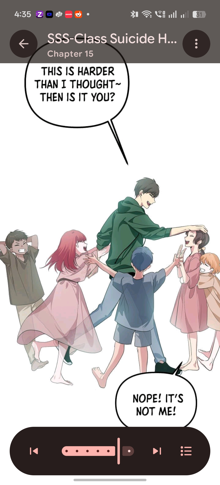
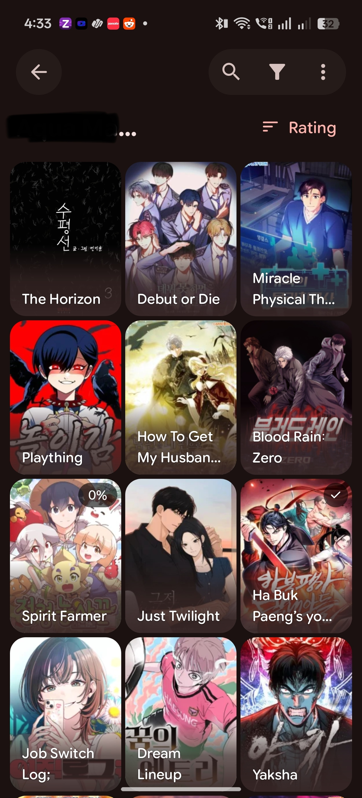
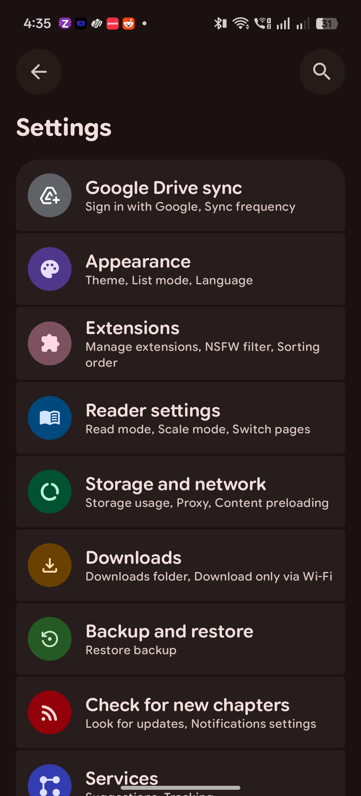

<p align="center">
  
</p>

<h1 align="center">Yomira</h1>

<p align="center">
  A lightweight, modern manga reader for Android with a beautiful Material 3 Expressive design.
</p>

<p align="center">
  <a href="https://github.com/heyshaquib/Yomira/releases/latest"></a>
  <a href="LICENSE"></a>
</p>

<p align="center">
  <a href="https://developer.android.com/"></a>
  <a href="https://kotlinlang.org/"></a>
  <a href="https://developer.android.com/compose"></a>
  <a href="https://m3.material.io/"></a>
</p>

<p align="center">
  <a href="https://github.com/heyshaquib/Yomira/releases/latest"><strong>Download APK</strong></a>
  |
  <a href="https://yomira-reader.vercel.app"><strong>Website</strong></a>
  |
  <a href="https://github.com/heyshaquib/Yomira/issues"><strong>Issues</strong></a>
</p>

---

## About

Yomira is a free and open-source manga reader for Android, built to feel quick, clean, and comfortable to use with a lot of features

⭐Please give the repo a star if you like the project. It helps more people find it.🌟

## Screenshots

<p align="center">
  
  
  
  
  
</p>

<p align="center">
  <sub>Favorites | Details | Reader | Extensions | Settings</sub>
</p>

## Highlights
- NEW: FULL EPUB READING SUPPORT (OFFLINE ONLY)
- Lightweight Android-first experience with a modern, polished interface.
- Full extension support with library, reading, history, bookmarks, tracking, stats, and settings tools.
- Google Drive sync, local backup/restore, and in-app updates to keep your setup moving with you.
- New animations, cleaner reader controls, and Material 3 Expressive screens built with Jetpack Compose.
- Free and open-source under the GPLv3 license.

<details>
<summary><strong>Features</strong></summary>

- Comfortable manga reading with configurable reader behavior.
- Full extension support powered by the open-source manga reader ecosystem.
- Favorites, history, bookmarks, tracking, stats, and categories to keep your library organized.
- Google Drive sync for library, history, bookmarks, tracking, stats, settings, and covers.
- Local backup and restore system for moving or protecting your setup.
- New Material 3 Expressive manga details page.
- New onboarding/welcome flow with sync and restore setup.
- Android widgets for continue reading, favorites, and reading stats.
- PDF import support, converting PDFs into readable CBZ chapters.
- App lock with biometric or device credential support.
- Downloads for offline reading when a source supports it.
- In-app updates, with APKs also published through GitHub Releases.

</details>

<details>
<summary><strong>Recent improvements</strong></summary>

- Cleaner reader controls and haptics.
- Better manga details page with Material 3 Expressive polish.
- New animations across newer app flows.
- Better reading progress tracking.
- Improved library and category filtering.
- Fewer crashes and UI bugs.
- Better build and release workflows.

</details>

## Install

1. Open the [latest GitHub release](https://github.com/heyshaquib/Yomira/releases/latest).
2. Download the newest `Yomira` APK.
3. Install it on a compatible Android device.
4. Add your preferred source or extension repository, then start reading.

Android may ask you to allow installs from your browser or file manager. That is normal for APKs downloaded outside the Play Store.

## FAQ

### Does Yomira include manga?
> No. Yomira does not include built-in content. Sources are provided through external libraries or repositories added by users.

### Is Yomira free?
> Yes. Yomira is free and open source under the GPLv3 license.

### How do updates work?
> Yomira supports in-app updates, and release APKs are also published on GitHub. You can update from inside the app or install the latest APK from the Releases page.

### Can I contribute?
> Yes. Pull requests for patches, fixes, and new features are welcome.

## Project structure

```plaintext
app/src/main/
├── kotlin/org/koitharu/kotatsu/
│   ├── core/          # Shared database, network, parser, preferences, UI, and utility code
│   ├── main/          # App entry points, main activity, and app-level screens
│   ├── reader/        # Manga reader UI and reading behavior
│   ├── details/       # Manga details, chapters, metadata, and related services
│   ├── explore/       # Browse and discovery screens
│   ├── search/        # Search screens and search flows
│   ├── favourites/    # Favorites and library-facing flows
│   ├── history/       # Reading history and progress
│   ├── download/      # Offline downloads and download queue
│   ├── extensions/    # Extension browsing and management
│   ├── backup/        # Local backup and restore
│   ├── sync/          # Sync data, domain, UI, and workers
│   ├── tracker/       # Tracking integrations
│   ├── widget/        # Android home screen widgets
│   └── settings/      # Settings screens and preferences
└── res/
    ├── drawable*/     # Icons, backgrounds, and app artwork
    ├── layout*/       # XML screens, widgets, and reusable layouts
    ├── mipmap*/       # Launcher icons
    ├── values*/       # Strings, colors, themes, and translations
    └── xml/           # Android XML configuration
```

## Contribute

You can send a Pull Request for your patches, fixes, or new features here.

1. Fork the repository.
2. Create a focused branch for your change.
3. Build locally with `./gradlew :app:assembleDebug`.
4. Open a Pull Request with a short explanation of what changed.

Small fixes are welcome. Clear screenshots or short screen recordings are extra helpful for UI changes.

## Credits

Yomira exists because of the work already done by the open-source Android manga reader community.

Special thanks to [DropSauce](https://github.com/HuzaifaKhalid1311/DropSauce) for design and architectural inspiration, the original [Kotatsu](https://github.com/KotatsuApp/Kotatsu) and [Mihon](https://github.com/mihonapp/mihon) developers for the robust source ecosystem and long-running maintenance work, and lastly, Our Lord And Saviour LLM Agents for making this all possible.

## Certificate fingerprints

<div align="left">

SHA1:

```plaintext
28:B3:37:7B:44:57:9E:B4:91:ED:7C:07:AB:14:B2:60:0E:14:F2:82
```

SHA256:

```plaintext
C3:D8:9C:31:72:CF:71:CE:A8:23:EF:47:62:71:C4:C1:5C:B3:A7:BA:4C:A4:C9:6C:63:88:ED:D0:2D:D8:45:EE
```

</div>


## License

[](http://www.gnu.org/licenses/gpl-3.0.en.html)

<div align="left">

All programs from Yomira™ project are free, open-source programs under the GPL license. You may copy, distribute, and modify the software as long as you keep track of changes/dates in the source files. Any modifications to the software, including code licensed under the GPL (via a compiler), must also be provided under the GPL license.

</div>

## Disclaimer

<div align="left">

The developer(s) of this application do not have any affiliation with the content providers available. If there is any content, it is provided by external libraries added or imported by users; the application itself does not include any built-in content.

</div>
